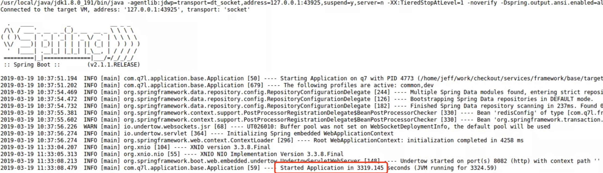
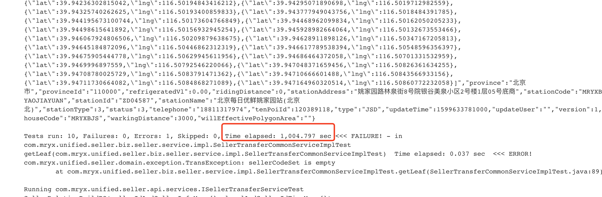
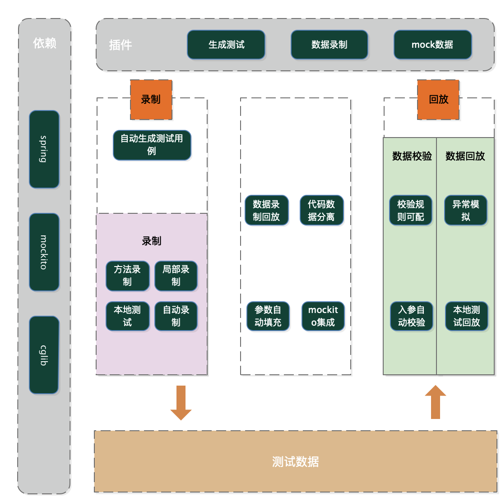

# 1 背景
&emsp;&emsp;在业务系统中开展测试一直是一个老大难问题。特别是在传统的Service+DAO的架构下，业务逻辑和技术细节杂糅在一起，代码的可测性很差，测试成本也很高。最后的结果是很少有开发人员愿意写测试代码， 比如测试驱动开发（Test Driven Development，TDD），行为驱动开发（Behaviour-Driven Development ，BDD）都是书本里的最佳实践，现实中根本用不起来。

[什么是TDD?](https://www.jianshu.com/p/62f16cd4fef3)

[什么是BDD？](https://www.cnblogs.com/coderzh/archive/2009/07/26/1531633.html)

&emsp;&emsp;此框架是笔者在公司原有的yaml测试框架的基础上迭代演进出2.0版本。新版本测试框架完全兼容YAML-TEST测试框架，之前用YAML-TEST测试框架写出的测试用例可以完美兼容2.0的测试框架，同学们可以放心使用。
为什么要写测试用例？

### 1.1 为什么要写测试用例？

- 验证我们代码的正确性
  
    我们写完代码通常要自己测试验证一番才会交付给QA进行测试。通常大家自我测试的方法就是跑一些程序，简单测试一下其中主要的分支场景，如果通过就认为自己的代码没有问题可以交付给QA了。但是事实上运行代码是很难测试一些特殊场景或者覆盖全部分支条件，比如很难模拟IOException，数据库访问异常等场景，或者穷尽各种边界条件等。而我们通过单元测试可以很轻松的构建各种测试场景，从而几乎100%确认我们的代码是可以交付给QA的。

- 保证修改(重构)的正确性
  
    很多时候我们不敢修改（重构）老代码的原因，就是不知道它的影响范围，担心其它模块因为依赖它而不工作，有了单元测试之后，只要在改完代码后运行一下单测就知道改动对整个系统的影响了，从而可以让我们放心的修改（重构）代码。

### 1.2 如果不写测试用例呢？

如果你不想写接口测试请回答如下2个问题：

- 你怎么证明你的代码是没有问题的？如果不能证明那么事实上是你将有缺陷的代码交付给了QA，由QA保证质量。

- 你们团队有足够多的优秀的测试人员吗？

### 1.3 传统测试面临的问题
•启动慢



&emsp;&emsp;不使用mock，需要启动dubbo、mongodb，mysql、rocketmq等容器服务，启动需要耗时2-5分钟不等，越大的项目启动时间越慢。

•执行慢



•很难维护

&emsp;&emsp;代码修改需要同步维护单测类，维护单测不比写代码的成本低。

•Mock成本高

&emsp;&emsp;常见的Mock框架（如mockito、powe rmock），都需要手工编写mock数据，同时需要人工写断言判断。

•环境依赖

&emsp;&emsp;依赖db特定数据、第三方服务，有状态的数据一旦被使用，需要重新造数据。如果单独部署测试库，成本很高。

# 2 什么是ark-test-framework？
&emsp;&emsp;为了解决集成上述问题及其他写测试用例中Mock成本高的问题，我们研发了分层测试框架。它可以自动帮助我们录制需要Mock的数据，并保存在本地，然后在运行集成测试时，自动进行注入、回放，从而极大地提升集成测试的效率。


# 3 框架特性
•无需手写mock数据，自动生成mock数据，大幅提升效率。

•数据一次录制，反复回放使用。

•对环境无依赖，不会侵入DB数据。

•自动生成测试用例方法

•自动数据校验

•轻量级测试框架，只需pom中增加一个jar包依赖

•代码和测试数据分离

•支持自动mock异常数据

•一行代码自动填充对象数据

•更方便的参数化测试

•支持代码片段录制

•支持多线程并发的场景

# 4 框架原理



&emsp;&emsp;layer-test通过录制真实环境数据，存储数据快照，单测时回放录制数据的测试框架。主要依赖mockito、cglib、spring，通过cglib的代理实现录制和回放数据，主要提供自动生成测试用例、录制、回放三大功能。


# 5 ark-test-framework 框架接入方式

```xml

1.增加pom配置，注意scope是test。

<dependency>
    <groupId>com.ark</groupId>
    <artifactId>test-framework</artifactId>
    <version>1.1</version>
    <scope>test</scope>
</dependency>

2.增加mock-test.xml配置，这一步目的是回放时通过exclude-filter将不需要Spring自动加载的Bean进行排除。

<beans xmlns="http://www.springframework.org/schema/beans"
       xmlns:xsi="http://www.w3.org/2001/XMLSchema-instance" xmlns:context="http://www.springframework.org/schema/context" xmlns:layer="http://www.missfresh.cn/schema/layer"
       xsi:schemaLocation="http://www.springframework.org/schema/beans
   http://www.springframework.org/schema/beans/spring-beans-3.1.xsd
   http://www.missfresh.cn/schema/layer http://www.missfresh.cn/schema/layer-mock.xsd
   http://www.springframework.org/schema/context http://www.springframework.org/schema/context/spring-context.xsd">


    <context:component-scan base-package="com.ark.test" />
    <context:exclude-filter type="annotation" expression="org.springframework.boot.autoconfigure.SpringBootApplication" />

<beans>

```
